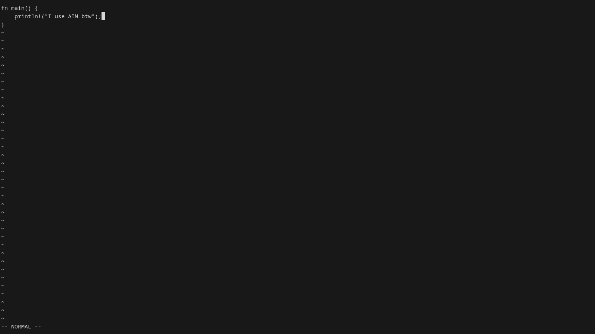

```text
 ______  ______               
/\  _  \/\__  _\   /'\_/`\    
\ \ \L\ \/_/\ \/  /\      \   
 \ \  __ \ \ \ \  \ \ \__\ \  
  \ \ \/\ \ \_\ \__\ \ \_/\ \ 
   \ \_\ \_\/\_____\\ \_\\ \_\
    \/_/\/_/\/_____/ \/_/ \/_/
```



# AIM

AIM is a lightweight terminal text editor written in Rust, inspired by Vim-style workflows. It features modal editing, command mode, and integration with **AExplorer**, a built-in terminal file explorer.

## Features

### AIM Editor

- Modal editing
  - Normal mode
  - Insert mode
  - Command mode
- Vim-style movement keys (`h`, `j`, `k`, `l`)
- Arrow key navigation
- File saving
- Open files through AExplorer
- Multi-line editing
- Backspace support
- Tab insertion
- Basic command system

### AExplorer

- Terminal file explorer
- Navigate directories
- Open files directly in AIM
- Create files
- Create directories
- Delete files and directories
- Copy files
- Copy directories recursively
- Move files and directories
- Rename files and directories
- Toggle hidden files
- Vim-style navigation keys

---

## Installation

### Prerequisites

- Rust
- Cargo

Install Rust:

```bash
curl --proto '=https' --tlsv1.2 -sSf https://sh.rustup.rs | sh
```

Clone the repository:

```bash
git clone https://github.com/yourusername/aim.git
cd aim
```

Build:

```bash
cargo build --release
```

Run:

```bash
cargo run
```

---

## Editor Controls

### Normal Mode

| Key | Action |
|------|---------|
| `h` | Move left |
| `j` | Move down |
| `k` | Move up |
| `l` | Move right |
| `i` | Enter Insert mode |
| `a` | Insert after the cursor |
| `A` | Go to the end of the line and insert|
| `o` | Add a new line below and insert |
| `O` | Add a new line above and insert |
| `:` | Enter Command mode |
| `0` | Beginning of the line |
| `$` | End of the line |
| `d` | Enter Delete mode |

Arrow keys also work for movement.

---

### Insert Mode

| Key | Action |
|------|---------|
| Any character | Insert text |
| `Enter` | New line |
| `Backspace` | Delete character |
| `Tab` | Insert 4 spaces |
| `Esc` | Return to Normal mode |

---

### Command Mode

Enter command mode with `:`.

| Command | Action |
|----------|---------|
| `:w` | Save file |
| `:q` | Quit |
| `:wq` | Save and quit |
| `:Ex` | Open AExplorer |

---

| Key | Action |
|------|---------|
| `d` | Delete Line |

---

## AExplorer Controls

| Key | Action |
|------|---------|
| `j` / ↓ | Move down |
| `k` / ↑ | Move up |
| `h` / ← | Go to parent directory |
| `l` / → | Enter directory |
| `Enter` | Open file in AIM |
| `a` | Create directory |
| `f` | Create file |
| `d` | Delete selected item |
| `c` | Copy file or directory |
| `m` | Move file or directory |
| `r` | Rename file or directory |
| `.` | Toggle hidden files |
| `?` | Show help |
| `q` | Quit explorer |

---

## Project Structure

```text
src/
├── main.rs
├── editor.rs
└── explorer.rs
```

- `main.rs` – Application entry point
- `editor.rs` – AIM editor implementation
- `explorer.rs` – AExplorer file manager

---

## Dependencies

- crossterm
- colored
- once_cell
- regex

---

## Goals

AIM aims to be:

- Lightweight
- Fast
- Keyboard-driven
- Easy to hack on
- Written entirely in Rust

---

## License

MIT License

---

## Acknowledgements

Inspired by:

- Vim
- Neovim
- Helix
- Kakoune

---

**AIM** — A simple Rust terminal editor.

**AExplorer** — A built-in terminal file explorer for AIM.
